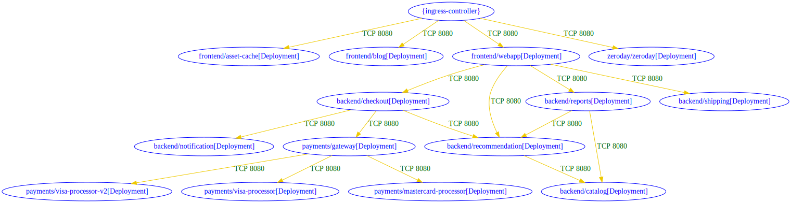

# `roxctl netpol` commands

## Roxctl v4.2 - netpol commands from np-guard integration

## Generation of network policies

https://github.com/stackrox/stackrox/tree/master/roxctl/netpol/generate

command is now `roxctl netpol generate` (instead of `roxctl generate netpol` )

## Connectivity map : analyze cluster permitted connectivity

https://github.com/stackrox/stackrox/tree/master/roxctl/netpol/connectivity/map

#### Goal
visualize the connectivity posture induced by the network policies and workloads manifests


#### Demo

Run `connectivity map` command on a dir of YAML manifests ,such as `Deployment, NetworkPolicy, Route` (copied from [security-demos](https://github.com/ralvares/security-demos) ): 
```
mkdir ~/demo
mkdir ~/demo/clone1
cd ~/demo/clone1/
git clone --branch roxctl_netpol_demo git@github.com:adisos/security-demos.git
cd security-demos/
roxctl netpol connectivity map .
```

The textual output for this run is:
```
backend/checkout[Deployment] => backend/notification[Deployment] : TCP 8080
backend/checkout[Deployment] => backend/recommendation[Deployment] : TCP 8080
backend/checkout[Deployment] => payments/gateway[Deployment] : TCP 8080
backend/recommendation[Deployment] => backend/catalog[Deployment] : TCP 8080
backend/reports[Deployment] => backend/catalog[Deployment] : TCP 8080
backend/reports[Deployment] => backend/recommendation[Deployment] : TCP 8080
frontend/webapp[Deployment] => backend/checkout[Deployment] : TCP 8080
frontend/webapp[Deployment] => backend/recommendation[Deployment] : TCP 8080
frontend/webapp[Deployment] => backend/reports[Deployment] : TCP 8080
frontend/webapp[Deployment] => backend/shipping[Deployment] : TCP 8080
payments/gateway[Deployment] => payments/mastercard-processor[Deployment] : TCP 8080
payments/gateway[Deployment] => payments/visa-processor-v2[Deployment] : TCP 8080
payments/gateway[Deployment] => payments/visa-processor[Deployment] : TCP 8080
{ingress-controller} => frontend/asset-cache[Deployment] : TCP 8080
{ingress-controller} => frontend/blog[Deployment] : TCP 8080
{ingress-controller} => frontend/webapp[Deployment] : TCP 8080
{ingress-controller} => zeroday/zeroday[Deployment] : TCP 8080
```

The `md` output format for `roxctl netpol connectivity map . -o md` is:


| src | dst | conn |
|-----|-----|------|
| backend/checkout[Deployment] | backend/notification[Deployment] | TCP 8080 |
| backend/checkout[Deployment] | backend/recommendation[Deployment] | TCP 8080 |
| backend/checkout[Deployment] | payments/gateway[Deployment] | TCP 8080 |
| backend/recommendation[Deployment] | backend/catalog[Deployment] | TCP 8080 |
| backend/reports[Deployment] | backend/catalog[Deployment] | TCP 8080 |
| backend/reports[Deployment] | backend/recommendation[Deployment] | TCP 8080 |
| frontend/webapp[Deployment] | backend/checkout[Deployment] | TCP 8080 |
| frontend/webapp[Deployment] | backend/recommendation[Deployment] | TCP 8080 |
| frontend/webapp[Deployment] | backend/reports[Deployment] | TCP 8080 |
| frontend/webapp[Deployment] | backend/shipping[Deployment] | TCP 8080 |
| payments/gateway[Deployment] | payments/mastercard-processor[Deployment] | TCP 8080 |
| payments/gateway[Deployment] | payments/visa-processor-v2[Deployment] | TCP 8080 |
| payments/gateway[Deployment] | payments/visa-processor[Deployment] | TCP 8080 |
| {ingress-controller} | frontend/asset-cache[Deployment] | TCP 8080 |
| {ingress-controller} | frontend/blog[Deployment] | TCP 8080 |
| {ingress-controller} | frontend/webapp[Deployment] | TCP 8080 |
| {ingress-controller} | zeroday/zeroday[Deployment] | TCP 8080 |


#### Connectivity graph visualization

**Step 1:**  run `roxctl netpol connectivity map . -o dot`
```
digraph {
        "backend/catalog[Deployment]" [label="backend/catalog[Deployment]" color="blue" fontcolor="blue"]
        "backend/checkout[Deployment]" [label="backend/checkout[Deployment]" color="blue" fontcolor="blue"]
        "backend/notification[Deployment]" [label="backend/notification[Deployment]" color="blue" fontcolor="blue"]
        "backend/recommendation[Deployment]" [label="backend/recommendation[Deployment]" color="blue" fontcolor="blue"]
        "backend/reports[Deployment]" [label="backend/reports[Deployment]" color="blue" fontcolor="blue"]
        "backend/shipping[Deployment]" [label="backend/shipping[Deployment]" color="blue" fontcolor="blue"]
        "frontend/asset-cache[Deployment]" [label="frontend/asset-cache[Deployment]" color="blue" fontcolor="blue"]
        "frontend/blog[Deployment]" [label="frontend/blog[Deployment]" color="blue" fontcolor="blue"]
        "frontend/webapp[Deployment]" [label="frontend/webapp[Deployment]" color="blue" fontcolor="blue"]
        "payments/gateway[Deployment]" [label="payments/gateway[Deployment]" color="blue" fontcolor="blue"]
        "payments/mastercard-processor[Deployment]" [label="payments/mastercard-processor[Deployment]" color="blue" fontcolor="blue"]
        "payments/visa-processor-v2[Deployment]" [label="payments/visa-processor-v2[Deployment]" color="blue" fontcolor="blue"]
        "payments/visa-processor[Deployment]" [label="payments/visa-processor[Deployment]" color="blue" fontcolor="blue"]
        "zeroday/zeroday[Deployment]" [label="zeroday/zeroday[Deployment]" color="blue" fontcolor="blue"]
        "{ingress-controller}" [label="{ingress-controller}" color="blue" fontcolor="blue"]
        "backend/checkout[Deployment]" -> "backend/notification[Deployment]" [label="TCP 8080" color="gold2" fontcolor="darkgreen"]
        "backend/checkout[Deployment]" -> "backend/recommendation[Deployment]" [label="TCP 8080" color="gold2" fontcolor="darkgreen"]
        "backend/checkout[Deployment]" -> "payments/gateway[Deployment]" [label="TCP 8080" color="gold2" fontcolor="darkgreen"]
        "backend/recommendation[Deployment]" -> "backend/catalog[Deployment]" [label="TCP 8080" color="gold2" fontcolor="darkgreen"]
        "backend/reports[Deployment]" -> "backend/catalog[Deployment]" [label="TCP 8080" color="gold2" fontcolor="darkgreen"]
        "backend/reports[Deployment]" -> "backend/recommendation[Deployment]" [label="TCP 8080" color="gold2" fontcolor="darkgreen"]
        "frontend/webapp[Deployment]" -> "backend/checkout[Deployment]" [label="TCP 8080" color="gold2" fontcolor="darkgreen"]
        "frontend/webapp[Deployment]" -> "backend/recommendation[Deployment]" [label="TCP 8080" color="gold2" fontcolor="darkgreen"]
        "frontend/webapp[Deployment]" -> "backend/reports[Deployment]" [label="TCP 8080" color="gold2" fontcolor="darkgreen"]
        "frontend/webapp[Deployment]" -> "backend/shipping[Deployment]" [label="TCP 8080" color="gold2" fontcolor="darkgreen"]
        "payments/gateway[Deployment]" -> "payments/mastercard-processor[Deployment]" [label="TCP 8080" color="gold2" fontcolor="darkgreen"]
        "payments/gateway[Deployment]" -> "payments/visa-processor-v2[Deployment]" [label="TCP 8080" color="gold2" fontcolor="darkgreen"]
        "payments/gateway[Deployment]" -> "payments/visa-processor[Deployment]" [label="TCP 8080" color="gold2" fontcolor="darkgreen"]
        "{ingress-controller}" -> "frontend/asset-cache[Deployment]" [label="TCP 8080" color="gold2" fontcolor="darkgreen"]
        "{ingress-controller}" -> "frontend/blog[Deployment]" [label="TCP 8080" color="gold2" fontcolor="darkgreen"]
        "{ingress-controller}" -> "frontend/webapp[Deployment]" [label="TCP 8080" color="gold2" fontcolor="darkgreen"]
        "{ingress-controller}" -> "zeroday/zeroday[Deployment]" [label="TCP 8080" color="gold2" fontcolor="darkgreen"]
}
```

**Step 2:** Choose one of the following options: 

**Option1:**
Use a locally installed Graphviz:
```
roxctl netpol connectivity map . -o dot > conn1.dot 
dot conn1.dot -Tsvg -O
```

**Option2:** copy the `dot` output into an online viewer. 



The connectivity graph is similar to the presented diagram from the original repo:


## Connectivity Diff:  diff analysis in terms of connectivity

https://github.com/stackrox/stackrox/tree/master/roxctl/netpol/connectivity/diff

Goal: Analyze two sets of Kubernetes manifests, including network policies, in terms of connectivity.
Produce a list of a differences in terms of allowed connections.


#### Demo1: example of added connections due to added workloads (with new network policies)

Scenario example: compare connectivity between two branch versions.
Both workloads and network policy manifests have been modified in the newer branch.

Prepare the branch of the old version:
```
cd ~/demo
mkdir clone2
cd clone2/
git clone --branch demo_branch_old_manifests git@github.com:adisos/security-demos.git
cd ~/demo
```
The branch of the new version is at clone1 from the previous demo above.

Run connectivity diff command on two versions (first is older than the second) of YAML manifests (such as Deployment, NetworkPolicy, Route) from security-demos:
```
roxctl netpol connectivity diff  --dir1 clone2/ --dir2 clone1/  -o md
```

The output of connectivity diff analysis in `md` format:

| diff-type | source | destination | dir1 | dir2 | workloads-diff-info |
|-----------|--------|-------------|------|------|---------------------|
| added | payments/gateway[Deployment] | payments/visa-processor-v2[Deployment] | No Connections | TCP 8080 | workload payments/visa-processor-v2[Deployment] added |
| added | {ingress-controller} | frontend/blog[Deployment] | No Connections | TCP 8080 | workload frontend/blog[Deployment] added |
| added | {ingress-controller} | zeroday/zeroday[Deployment] | No Connections | TCP 8080 | workload zeroday/zeroday[Deployment] added |


#### Demo2: 

Scenario example: compare connectivity between two branch versions.
Only workload manifests have been modified in the newer branch.
Assume that the required updates for network policies have not been made on the newer branch yet.


```
cp clone2/security-demos/netpol/all.yaml clone1/security-demos/netpols/all.yaml
roxctl netpol connectivity diff  --dir1 clone2/ --dir2 clone1/  -o md
```
The connectivity diff output for this example:

| diff-type | source | destination | dir1 | dir2 | workloads-diff-info |
|-----------|--------|-------------|------|------|---------------------|
| added | 0.0.0.0-255.255.255.255 | zeroday/zeroday[Deployment] | No Connections | All Connections | workload zeroday/zeroday[Deployment] added |
| added | backend/checkout[Deployment] | zeroday/zeroday[Deployment] | No Connections | UDP 5353 | workload zeroday/zeroday[Deployment] added |
| added | backend/recommendation[Deployment] | zeroday/zeroday[Deployment] | No Connections | UDP 5353 | workload zeroday/zeroday[Deployment] added |
| added | backend/reports[Deployment] | zeroday/zeroday[Deployment] | No Connections | UDP 5353 | workload zeroday/zeroday[Deployment] added |
| added | frontend/webapp[Deployment] | zeroday/zeroday[Deployment] | No Connections | UDP 5353 | workload zeroday/zeroday[Deployment] added |
| added | payments/gateway[Deployment] | zeroday/zeroday[Deployment] | No Connections | UDP 5353 | workload zeroday/zeroday[Deployment] added |
| added | zeroday/zeroday[Deployment] | 0.0.0.0-255.255.255.255 | No Connections | All Connections | workload zeroday/zeroday[Deployment] added |
| added | zeroday/zeroday[Deployment] | frontend/asset-cache[Deployment] | No Connections | TCP 8080 | workload zeroday/zeroday[Deployment] added |
| added | zeroday/zeroday[Deployment] | frontend/webapp[Deployment] | No Connections | TCP 8080 | workload zeroday/zeroday[Deployment] added |
| added | {ingress-controller} | zeroday/zeroday[Deployment] | No Connections | TCP 8080 | workload zeroday/zeroday[Deployment] added |

#### Demo3: example of changed connections due to changes in network policy manifests

Scenario example: a typo in a label of a `podSelector`, manually edited in a network policy YAML.

```
--- a/netpols/all.yaml
+++ b/netpols/all.yaml
@@ -101,7 +101,7 @@
                             {
                                 "podSelector": {
                                     "matchLabels": {
-                                        "app": "recommendation"
+                                        "app": "recomendation"
                                     }
                                 }
                             }
```

Diff output: 

| diff-type | source | destination | dir1 | dir2 | workloads-diff-info |
|-----------|--------|-------------|------|------|---------------------|
| removed | backend/recommendation[Deployment] | backend/catalog[Deployment] | TCP 8080 | No Connections |  |						


##  Gaps to be handled
1. Ingress/Route resources to be considered by generated network policies from `roxctl netpol generate`
2. Better support for specific Ingress-controllers to be considered, in generation and analysis by `roxctl netpol` commands (for a more refined permitted connectivity based on Route/Ingress rules).
3. Support `Namespace` manifests without `kubernetes.io/metadata.name` label  by `roxctl netpol` commands
