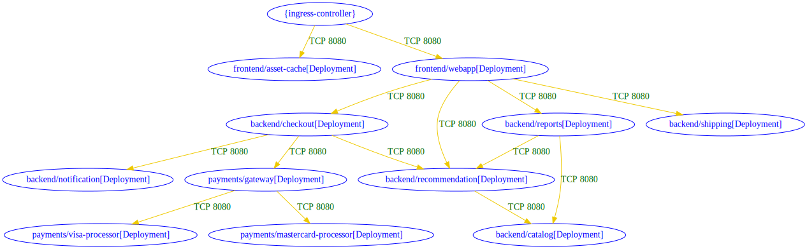
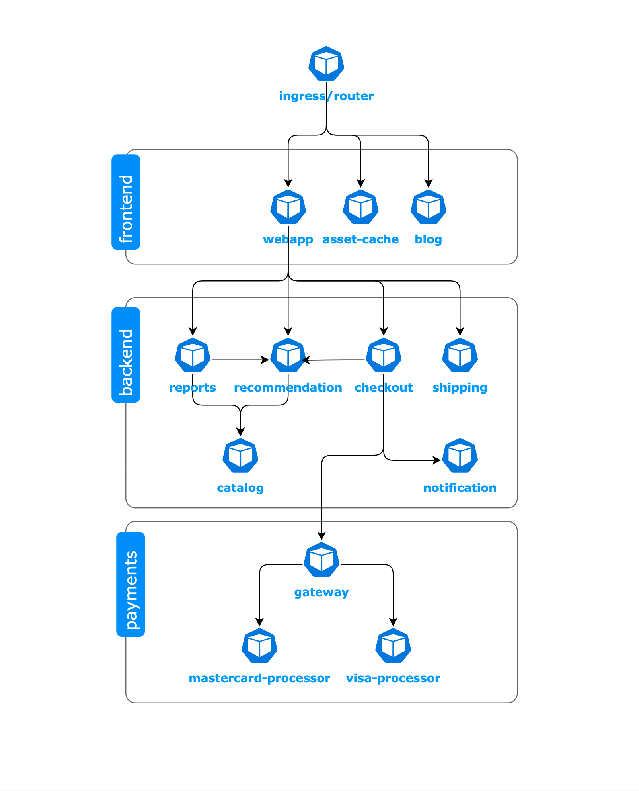

# `roxctl netpol` commands

## Roxctl v4.2 - netpol commands from np-guard integration

## Generation of network policies

command is now `roxctl netpol generate` (instead of `roxctl generate netpol` )

## Connectivity map : analyze cluster permitted connectivity

https://github.com/stackrox/stackrox/tree/master/roxctl/netpol/connectivity/map

#### Goal
visualize the connectivity posture induced by the network policies and workloads manifests


#### Demo

Run `connectivity map` command on a dir of YAML manifests ,such as `Deployment, NetworkPolicy, Route` (copied from [security-demos](https://github.com/ralvares/security-demos) ): 
```
git clone git@github.com:np-guard/netpol-analyzer.git
cd netpol-analyzer/tests/acs-security-demos-with-netpol-list
roxctl netpol connectivity map .
```

The textual output for this run is:
```
backend/checkout[Deployment] => backend/notification[Deployment] : TCP 8080
backend/checkout[Deployment] => backend/recommendation[Deployment] : TCP 8080
backend/checkout[Deployment] => payments/gateway[Deployment] : TCP 8080
backend/recommendation[Deployment] => backend/catalog[Deployment] : TCP 8080
backend/reports[Deployment] => backend/catalog[Deployment] : TCP 8080
backend/reports[Deployment] => backend/recommendation[Deployment] : TCP 8080
frontend/webapp[Deployment] => backend/checkout[Deployment] : TCP 8080
frontend/webapp[Deployment] => backend/recommendation[Deployment] : TCP 8080
frontend/webapp[Deployment] => backend/reports[Deployment] : TCP 8080
frontend/webapp[Deployment] => backend/shipping[Deployment] : TCP 8080
payments/gateway[Deployment] => payments/mastercard-processor[Deployment] : TCP 8080
payments/gateway[Deployment] => payments/visa-processor[Deployment] : TCP 8080
{ingress-controller} => frontend/asset-cache[Deployment] : TCP 8080
{ingress-controller} => frontend/webapp[Deployment] : TCP 8080
```

The `md` output format for `roxctl netpol connectivity map . -o md` is:


| src | dst | conn |
|-----|-----|------|
| backend/checkout[Deployment] | backend/notification[Deployment] | TCP 8080 |
| backend/checkout[Deployment] | backend/recommendation[Deployment] | TCP 8080 |
| backend/checkout[Deployment] | payments/gateway[Deployment] | TCP 8080 |
| backend/recommendation[Deployment] | backend/catalog[Deployment] | TCP 8080 |
| backend/reports[Deployment] | backend/catalog[Deployment] | TCP 8080 |
| backend/reports[Deployment] | backend/recommendation[Deployment] | TCP 8080 |
| frontend/webapp[Deployment] | backend/checkout[Deployment] | TCP 8080 |
| frontend/webapp[Deployment] | backend/recommendation[Deployment] | TCP 8080 |
| frontend/webapp[Deployment] | backend/reports[Deployment] | TCP 8080 |
| frontend/webapp[Deployment] | backend/shipping[Deployment] | TCP 8080 |
| payments/gateway[Deployment] | payments/mastercard-processor[Deployment] | TCP 8080 |
| payments/gateway[Deployment] | payments/visa-processor[Deployment] | TCP 8080 |
| {ingress-controller} | frontend/asset-cache[Deployment] | TCP 8080 |
| {ingress-controller} | frontend/webapp[Deployment] | TCP 8080 |


#### Connectivity graph visualization

**Step 1:**  run `roxctl netpol connectivity map . -o dot`
```
digraph {
        "backend/catalog[Deployment]" [label="backend/catalog[Deployment]" color="blue" fontcolor="blue"]
        "backend/checkout[Deployment]" [label="backend/checkout[Deployment]" color="blue" fontcolor="blue"]
        "backend/notification[Deployment]" [label="backend/notification[Deployment]" color="blue" fontcolor="blue"]
        "backend/recommendation[Deployment]" [label="backend/recommendation[Deployment]" color="blue" fontcolor="blue"]
        "backend/reports[Deployment]" [label="backend/reports[Deployment]" color="blue" fontcolor="blue"]
        "backend/shipping[Deployment]" [label="backend/shipping[Deployment]" color="blue" fontcolor="blue"]
        "frontend/asset-cache[Deployment]" [label="frontend/asset-cache[Deployment]" color="blue" fontcolor="blue"]
        "frontend/webapp[Deployment]" [label="frontend/webapp[Deployment]" color="blue" fontcolor="blue"]
        "payments/gateway[Deployment]" [label="payments/gateway[Deployment]" color="blue" fontcolor="blue"]
        "payments/mastercard-processor[Deployment]" [label="payments/mastercard-processor[Deployment]" color="blue" fontcolor="blue"]
        "payments/visa-processor[Deployment]" [label="payments/visa-processor[Deployment]" color="blue" fontcolor="blue"]
        "{ingress-controller}" [label="{ingress-controller}" color="blue" fontcolor="blue"]
        "backend/checkout[Deployment]" -> "backend/notification[Deployment]" [label="TCP 8080" color="gold2" fontcolor="darkgreen"]
        "backend/checkout[Deployment]" -> "backend/recommendation[Deployment]" [label="TCP 8080" color="gold2" fontcolor="darkgreen"]
        "backend/checkout[Deployment]" -> "payments/gateway[Deployment]" [label="TCP 8080" color="gold2" fontcolor="darkgreen"]
        "backend/recommendation[Deployment]" -> "backend/catalog[Deployment]" [label="TCP 8080" color="gold2" fontcolor="darkgreen"]
        "backend/reports[Deployment]" -> "backend/catalog[Deployment]" [label="TCP 8080" color="gold2" fontcolor="darkgreen"]
        "backend/reports[Deployment]" -> "backend/recommendation[Deployment]" [label="TCP 8080" color="gold2" fontcolor="darkgreen"]
        "frontend/webapp[Deployment]" -> "backend/checkout[Deployment]" [label="TCP 8080" color="gold2" fontcolor="darkgreen"]
        "frontend/webapp[Deployment]" -> "backend/recommendation[Deployment]" [label="TCP 8080" color="gold2" fontcolor="darkgreen"]
        "frontend/webapp[Deployment]" -> "backend/reports[Deployment]" [label="TCP 8080" color="gold2" fontcolor="darkgreen"]
        "frontend/webapp[Deployment]" -> "backend/shipping[Deployment]" [label="TCP 8080" color="gold2" fontcolor="darkgreen"]
        "payments/gateway[Deployment]" -> "payments/mastercard-processor[Deployment]" [label="TCP 8080" color="gold2" fontcolor="darkgreen"]
        "payments/gateway[Deployment]" -> "payments/visa-processor[Deployment]" [label="TCP 8080" color="gold2" fontcolor="darkgreen"]
        "{ingress-controller}" -> "frontend/asset-cache[Deployment]" [label="TCP 8080" color="gold2" fontcolor="darkgreen"]
        "{ingress-controller}" -> "frontend/webapp[Deployment]" [label="TCP 8080" color="gold2" fontcolor="darkgreen"]
}
```

**Step 2:** Choose one of the following options: 

**Option1:**
Use a locally installed Graphviz, save the `dot` output into a file `conn.dot` and run: `dot conn.dot -Tsvg -O`

**Option2:** copy the `dot` output into an online viewer. 



The connectivity graph is similar to the presented diagram from the original repo:




## Connectivity Diff:  diff analysis in terms of connectivity

https://github.com/stackrox/stackrox/tree/master/roxctl/netpol/connectivity/diff

Goal: Analyze two sets of Kubernetes manifests, including network policies, in terms of connectivity.
Produce a list of a differences in terms of allowed connections.

#### Demo1: example of added connections due to added workloads (with new network policies)
Run connectivity diff command on two versions (first is older than the second) of YAML manifests (such as Deployment, NetworkPolicy, Route) from security-demos:
```
 roxctl netpol connectivity diff --dir1=acs-security-demos-with-netpol-list/ --dir2=acs-security-demos-added-workloads/  -o md
```

The output of connectivity diff analysis in `md` format:

| diff-type | source | destination | dir1 | dir2 | workloads-diff-info |
|-----------|--------|-------------|------|------|---------------------|
| added | payments/gateway[Deployment] | payments/visa-processor-v2[Deployment] | No Connections | TCP 8080 | workload payments/visa-processor-v2[Deployment] added |
| added | {ingress-controller} | frontend/blog[Deployment] | No Connections | TCP 8080 | workload frontend/blog[Deployment] added |
| added | {ingress-controller} | zeroday/zeroday[Deployment] | No Connections | TCP 8080 | workload zeroday/zeroday[Deployment] added |

#### Demo2: example of changed connections due to changes in network policy manifests

```
diff acs-security-demos/acs_netpols.yaml acs-security-demos-new/acs_netpols.yaml
10,15c10
<   ingress:
<   - from:
<     - namespaceSelector: {}
<     ports:
<     - port: 8080
<       protocol: TCP
---
>   ingress: [] # blocking any ingress
46c41
<     - port: 8080
---
>     - port: 9080       # changed to the new port
130c125
<           app: mastercard-processor
---
>           app: mastercard-processor  # removed its deployment - the rules will not be considered
278c273
<     - port: 8080
---
>     - port: 9080  # changed
324,334c319
<   ingress:
<   - from:
<     - namespaceSelector:
<         matchLabels:
<           kubernetes.io/metadata.name: frontend
<       podSelector:
<         matchLabels:
<           app: webapp
<     ports:
<     - port: 8080
<       protocol: TCP
---
>   ingress: [] # removed
408,417c393
<   - ports:
<     - port: 8080
<       protocol: TCP
<     to:
<     - namespaceSelector:
<         matchLabels:
<           kubernetes.io/metadata.name: backend
<       podSelector:
<         matchLabels:
<           app: shipping
---
>   # removed conn
```

Run of `roxctl netpol connectivity diff --dir1=acs-security-demos-with-netpol-list/ --dir2=acs-security-demos-new -o md` :


| diff-type | source | destination | dir1 | dir2 | workloads-diff-info |
|-----------|--------|-------------|------|------|---------------------|
| changed | backend/reports[Deployment] | backend/catalog[Deployment] | TCP 8080 | TCP 9080 |  |
| added | 0.0.0.0-255.255.255.255 | external/unicorn[Deployment] | No Connections | All Connections | workload external/unicorn[Deployment] added |
| added | backend/checkout[Deployment] | external/unicorn[Deployment] | No Connections | UDP 5353 | workload external/unicorn[Deployment] added |
| added | backend/recommendation[Deployment] | external/unicorn[Deployment] | No Connections | UDP 5353 | workload external/unicorn[Deployment] added |
| added | backend/reports[Deployment] | external/unicorn[Deployment] | No Connections | UDP 5353 | workload external/unicorn[Deployment] added |
| added | external/unicorn[Deployment] | 0.0.0.0-255.255.255.255 | No Connections | All Connections | workload external/unicorn[Deployment] added |
| added | external/unicorn[Deployment] | frontend/webapp[Deployment] | No Connections | TCP 8080 | workload external/unicorn[Deployment] added |
| added | frontend/webapp[Deployment] | external/unicorn[Deployment] | No Connections | UDP 5353 | workload external/unicorn[Deployment] added |
| added | payments/gateway[Deployment] | external/unicorn[Deployment] | No Connections | UDP 5353 | workload external/unicorn[Deployment] added |
| removed | frontend/webapp[Deployment] | backend/shipping[Deployment] | TCP 8080 | No Connections |  |
| removed | payments/gateway[Deployment] | payments/mastercard-processor[Deployment] | TCP 8080 | No Connections | workload payments/mastercard-processor[Deployment] removed |
| removed | {ingress-controller} | frontend/asset-cache[Deployment] | TCP 8080 | No Connections |  |